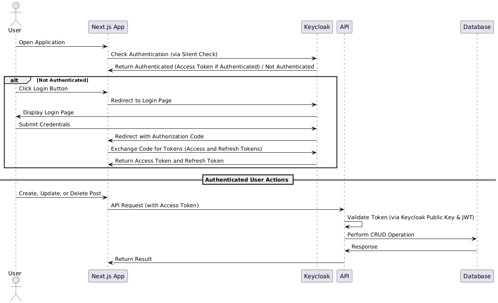

# Hive Blogging Platform

The **Hive** platform is a full-stack blogging application built using **Next.js** for the frontend and **Node.js/Express** for the backend. The app uses **Sequelize** for database management with PostgreSQL, **Zod** for API data validation, and **Keycloak** for user authentication. Backend routes are structured with **tRPC** for type-safe API development, and the entire project is written in **TypeScript** to maintain consistent typing.

This project is organized as a **monorepo** using **TurboRepo**, with both the frontend and backend in the same repository but managed separately.

## Tech Stack

### Backend:

- **Node.js**: JavaScript runtime for the API.
- **Express**: Web framework for building the API.
- **Sequelize**: ORM for interacting with PostgreSQL.
- **Zod**: Type-safe schema validation for API requests and responses.
- **tRPC (partial implementation)**: Backend routes are structured with tRPC for type-safe API development.
- **Keycloak**: Manages user authentication and authorization using bearer tokens sent from the frontend.
- **TypeScript**: Type-safe language used across both frontend and backend.

### Frontend:

- **Next.js**: React-based framework for building SSR pages and static sites.
- **Keycloak**: Handles login and user authentication.
- **API Context Provider**: Custom React context to manage API state and simplify request handling.
- **TypeScript**: Used for type safety and consistency across the codebase.

### Deployment:

- **Vercel**: Platform used for hosting both the frontend and backend services.
- **Keycloak**: Requires a separate server (not hosted on Vercel).
- **PostgreSQL**: Requires a separate database server.

You can view the live app at: [Hive App](https://hive-5wzvg6bcd-raniaalouns-projects.vercel.app/)

## Project Structure

- **apps/web**: Frontend application
- **apps/api**: Backend application

## Features

- **User Authentication**: Users can register, log in, and manage their blog posts, protected by Keycloak authentication.
- **Post Management**: Users can create, edit, and delete blog posts.
- **State Management**: The app uses a custom API context to manage global state for authentication and blog data.
- **Type Safety**: TypeScript ensures that both backend and frontend maintain strong typing, reducing runtime errors.

### System Sequence Diagram



## Design Patterns

- **Singleton & Provider Patterns**: Implemented through the **API Provider** & **Auth Provider** on the frontend, ensuring centralized and consistent API & Auth state across the entire application.

## Getting Started

To run Hive locally:

### Prerequisites

Make sure the following are installed:

- **Node.js**
- **npm**
- **Docker**

### Clone the Repository

Clone the repo using:

```bash
git clone <repository-url>
```

### Keycloak Setup

1. **Start a Keycloak container**:

   ```bash
   docker run -d -p 4000:8080 -e KC_BOOTSTRAP_ADMIN_USERNAME=admin -e KC_BOOTSTRAP_ADMIN_PASSWORD=admin quay.io/keycloak/keycloak:26.2.1 start-dev
   ```

2. **Open Keycloak Admin Console** at [http://localhost:4000](http://localhost:4000).

3. **Configure Keycloak**:

   - Create a **new realm** called `hiveRealm`.
   - Create a **new client** under the `hiveRealm` named `web`.
     - Set **Client Protocol** to: `openid-connect`.
     - Add `http://localhost:3000/*` as a **Valid Redirect URI**.
     - Enable **Standard Flow** and **Direct Access Grants** under Authentication Flow.

4. **Obtain the Keycloak Public Key**:

   - In the realm settings, go to **Keys**, select the RSA key, and copy the **public key**.

5. **Update your Backend**:
   - Open `apps/api/src/server/middlewares/keycloak-middleware.ts`.
   - Paste the public key into the `rawKey` field.

---

## Running the Application

1. **Install dependencies**:

   ```bash
   npm install
   ```

2. **Run the project using TurboRepo**:

   ```bash
   turbo run dev
   ```

3. **Open your browser and visit**:

   ```
   http://localhost:3000/
   ```

You should now be able to log in and start testing the blogging platform.

---

## Demo

Watch the demo video here: [Hive Blogging Platform Demo](https://www.youtube.com/watch?v=edqoWUD-nb8)

## Design Decisions

### **Monorepo with TurboRepo** and **Keycloak**:

The decision to use a **monorepo** with **TurboRepo** & **Keycloak** was driven by the opportunity to explore new tools and expand my experience. Since **monorepo** and **Keycloak** are used in Averta, I saw this project as a chance to gain hands-on experience and understand the business.

### **React Context API**:

To manage global state for authentication and API data, I utilized the **React Context API**, which simplifies state management and ensures all components have access to necessary data without prop drilling.

### **Centralized State Management**:

Rather than having individual components manage API logic, I centralized the API calls within a single **API Provider**. This approach reduces redundant code, ensures consistent API state management, and provides a single point of control for all API-related actions.

### **TypeScript & tRPC**:

Both the frontend and backend were built with **TypeScript** to enforce type safety across the application. This decision improved code quality by helping me catch errors early in the development process.
I used **tRPC** to structure routes for type-safe API development. This was a partial implementation, allowing me to explore tRPC and learn how it facilitates type-safe communication between the frontend and backend.

### **Sequelize and Zod**:

For database management, I utilized **Sequelize**, an ORM for PostgreSQL, which simplifies data interaction and fits the requirements of the application. Additionally, I integrated **Zod** for input validation to ensure all incoming data is validated both on the frontend (for type safety) and the backend (for security).
